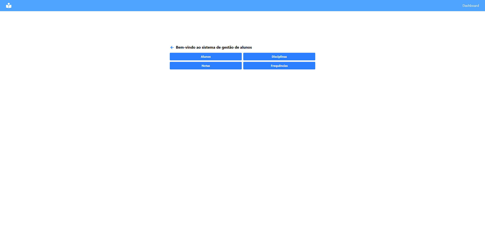

# Sistema de Gerenciamento de Estudantes



## Descrição

Este sistema ajuda o professor Carlos a organizar notas e frequência dos alunos. Com ele, é possível:

- Cadastrar, editar e excluir estudantes e disciplinas.
- Inserir notas (0 a 10) para cinco disciplinas por aluno.
- Registrar a frequência em percentual (0 a 100%).

**Calcular automaticamente:**

- Média das notas por aluno e por disciplina.
- Média geral da turma.
- Frequência geral de cada aluno.

**Identificar:**

- Alunos com desempenho acima da média da turma.
- Alunos com frequência abaixo de 75%, que precisam de atenção especial.

## Tecnologias

- React
- TypeScript
- TailwindCSS
- Axios

## Requisitos

- Node.js

## Como rodar o projeto

1. Clone o repositório

```bash
git clone
```

2. Instale as dependências

```bash
npm install
```

3. Rode o projeto

```bash
npm run dev
```

4. Acesse o projeto em [http://localhost:5173/](http://localhost:5173/)

## Projeto Backend

O backend do projeto está disponível em [student_management_api](https://github.com/Ruan-Moraes/student_management_api)

## Observações

Não foquei muito no design e nem muito na qualidade do código, pois o foco era a lógica do sistema.
